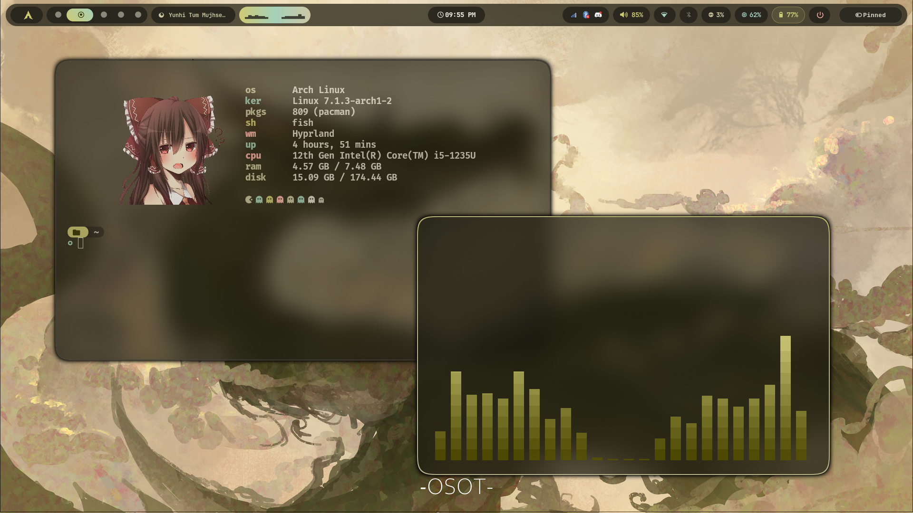

# 󰄛 kitty.conf

A minimalist, high-performance Kitty configuration styled dynamically using Material Design 3 palettes via Matugen.
Alternative, GPU-accelerated terminal environment tailored for seamless workflows under Wayland and Hyprland.

---

## 󰏊 Preview



_Theme colors adapt on-the-fly to the system wallpaper palette._

---

## 󰓼 Features

- **Matugen Powered:** Fully dynamic color compliance (borders, text, tabs, and markers).
- **Aesthetic Layout:** Clean rounded-powerline tab bar styling with clear workspace indicators.
- **Wayland Native:** Configured specifically for high-refresh rendering under Wayland/Hyprland.
- **Fluid Effects:** Smooth cursor trailing enabled with tailored decay metrics.
- **Ligated Typography:** Driven by `FiraCode Nerd Font SemBd` with constant ligature evaluation.

---

## 🛠️ Structure

```env
~/.config/kitty/
├── kitty.conf   # Main configuration engine
└── colors.conf  # Generated color definitions (Matugen)
```

---

## ⌨️ Keybindings

| Key Combo              | Action                                         |
| ---------------------- | ---------------------------------------------- |
| `Ctrl + Shift + F5`    | Live reload configuration without restarting   |
| `Ctrl + Shift + = / -` | Increment / decrement font scaling scales      |
| `Alt + H / J / K / L`  | Navigate localized terminal windows seamlessly |
